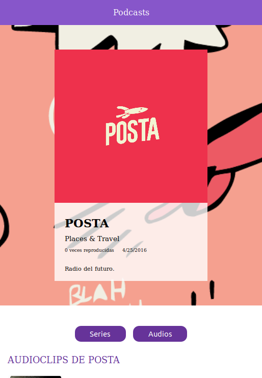

# App de Podcasts

App de podcasts integrada con la api de AudioBoom para aprender el framework que trabaja sobre React: Next.js

[Mira la aplicación!]()

## Cómo empezar

Requiere Node.JS 10

- `npm install` para instalar dependencias.
- `npm run dev` para el entorno de desarrollo.
- `npm run build && npm start` para el entorno de producción.

## Licencia

MIT
